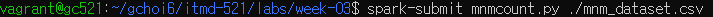
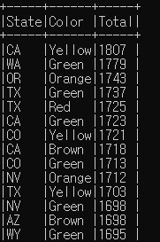
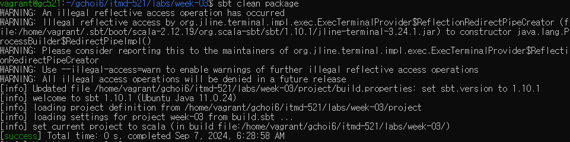
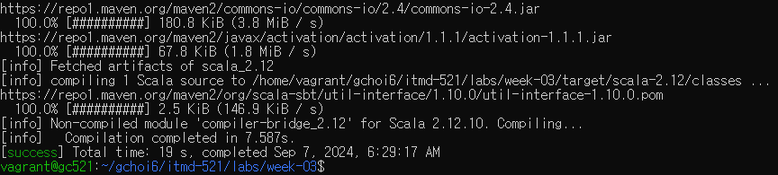
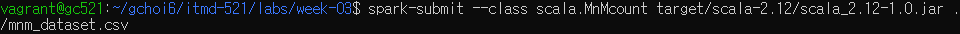
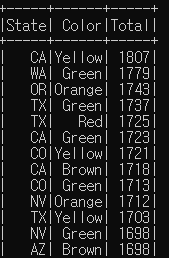

# 🍬 MnM Count Analysis with PySpark and Scala

This project uses **Apache Spark** to analyze MnM candy color counts across various states. The analysis is performed using both **Python (PySpark)** and **Scala** to compare and understand Spark applications in different programming languages.

## 📄 Overview
The goal of this project is to demonstrate Spark’s data processing capabilities using two versions of a Spark application. Both implementations count and display MnM color distribution across different states, with a specific analysis for California.

## 💻 Running the Project
- **Python (PySpark)**: 
  ```bash
  spark-submit mnmcount.py ./mnm_dataset.csv
  ```
    
  

- **Scala**:
  Compile the Scala code with **SBT** and then run it with:
  ```bash
  spark-submit --class scala.Mnmcount target/scala-2.12/scala_2.12-1.0.jar ./mnm_dataset.csv
  ```
    
  

  **Scala Spark Application Output Screenshot**:
      
  

## 🔎 Summary
This project showcases how to use Spark to analyze data with Python and Scala, comparing code structure and execution for both languages. The results show the distribution of MnM colors across different states and California.

## 📝 Notes
- This project was executed on a local Spark cluster in a **Vagrant Ubuntu environment**.
- The `build.sbt` file is included for Scala compilation with SBT.
- No data files are included to avoid large file uploads.
- **Dataset**: The dataset used for this project can be downloaded from the [Learning Spark V2 repository](https://github.com/databricks/LearningSparkV2/tree/master/chapter2/scala/data).

---

### Repository Name
`mnm-count-analysis`

### One-Sentence Description
> "Spark-based analysis of MnM color counts across states using PySpark and Scala for comparison."
